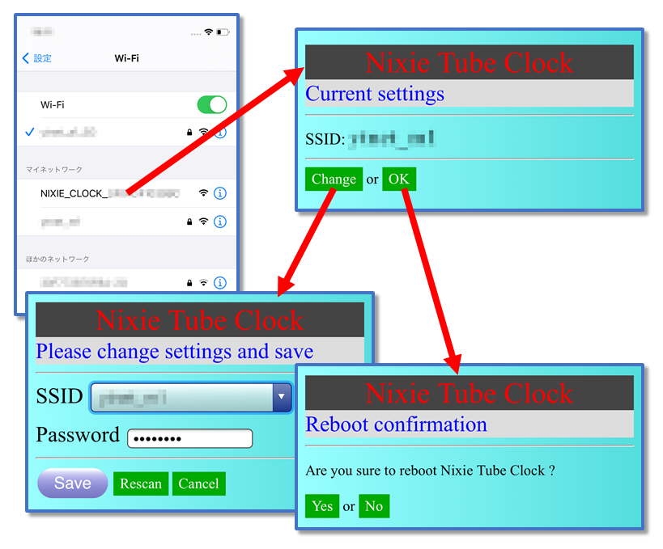

# NixiClock


現在入手困難な、本物のニキシー管を使った時計です。

レトロな外観ではありますが、
WiFi経由でインターネット上の時刻サーバーから、
正確な時刻を取得して、
常に正確な時刻を刻みます。

* WiFi経由で、インターネット上の時刻サーバー(NTPサーバー)から
  正確な時刻を取得するので、時刻合わせが不要です。
  
  WiFi設定は、スマホで行います。

  (WiFi環境がない場合は、マニュアルで時刻設定することもできます。)

* 明るさの調節が可能。

  暗い部屋で眩しいときは、明るさを調整できます。

* 3つの表示モード
  + 時:分:秒
  + 日:時:分
  + 年:月:日


## 1. コロンの表示

* 【点滅】WiFi接続 OK

  インターネット経由で、自動的に時刻合わせが行われています。
  
  ([BTN0]で、強制的にアクセスポイントモードにすることで、
  自動的な時刻合わせを停止することもできます)

* 【点灯】WiFi接続 なし(アクセスポイントモード)

  スマホを使って、本時計の WiFiを設定するか、
  マニュアルで時刻を設定してください。

  一度、時刻を合わせをすれば、
  この状態でも、
  RTC(Real Time Clock)から、時刻を取得し、
  時計として使いつづけることができます。


## 2. 操作法

## 2.1. ボタン概要

時計表示のとき
```
   +---------- [BTN0] 時刻合わせ(長押し)、WiFi設定(ダブルクリック)
   |  +------- [BTN1] 表示モード変更
   |  |  +---- [BTN2] 明るさ変更
   |  |  |
 --v--v--v--
|  o  o  o  | -> 前
 -----------
```

手動時刻合わせのとき
```
   +---------- [BTN0] 時刻合わせキャンセル(長押し)
   |  +------- [BTN1] 年 -> 月 -> 日 -> 時 -> 分 -> [確定]
   |  |  +---- [BTN2] カウントアップ
   |  |  |
 --v--v--v--
|  o  o  o  | -> 前
 -----------
```


## 2.2 表示モード変更 [BTN1]

* 以下の3つのモードをサイクリックに変更
  + 時:分:秒
  + 日:時:分
  + 年:月:日


## 2.3 明るさ変更 [BTN2]

* 5段階の明るさを順番に変更(サイクリック)
* リーピート対応
* マルチクリックすると、その回数だけ変化


### 2.4 時刻合わせ (WiFi環境がある場合)

WiFi経由でインターネットに接続すれば、
NTP(Network Time Protocol)を使って、
インターネットから正確な時刻を取得して、
自動的に時刻合わせを行います。

1. [BTN0] を ダブルクリックしてください。

2. アクセスポイント・モードになり、コロンが点灯します。

3. スマホのWiFi設定で、「NIXIE_CLOCK_XXXXXXXX」に接続してください。

4. 接続すると、ブラウザが自動起動されます。

5. SSIDを設定し、保存してください。

6. [OK]で、時計が再起動再起動します。
   スマホのWiFi設定を元に戻してください。




### 2.5 時刻合わせ (手動)

RTC(Real Time Clock)が、バッテリーでバックアップされているので、
電源を入れ直しても、時刻合わせをし直す必要はありません。

1. [BTN0] を 長押しして、時刻設定モードに移行

    年 -> 月 -> 日 -> 時 -> [確定]
    
    の順番で設定します。
   (秒は、常に「00」)
   
2. [BTN2] で 数値がカウントアップ

3. [BTN1] で 数値が確定

4. 「分」を確定すると、
   時刻が修正され、
   時計表示に戻ります。
   
5. 設定を中断したい場合は、
   [BTN0] を長押ししてください。

   (元の時刻に戻ります)

(WiFi経由でインターネットに接続している場合は、
この手順で時刻を変更しても、
定期的にインターネットから時刻を取得して補正されます。)


## 9. 開発環境

* Arduino IDE 1.8.15(Windows store 1.8.49.0) on Windows 10
  - ボード・ライブラリ: ESP32 1.0.6
  - RTCライブラリ: RTClib by Adafruit 1.13.0


## A. References

* [github: arduino-esp32](https://github.com/espressif/arduino-esp32/)

* [github: EspExceptionDecoder(スタックトレース表示)](https://github.com/me-no-dev/EspExceptionDecoder/releases/)
